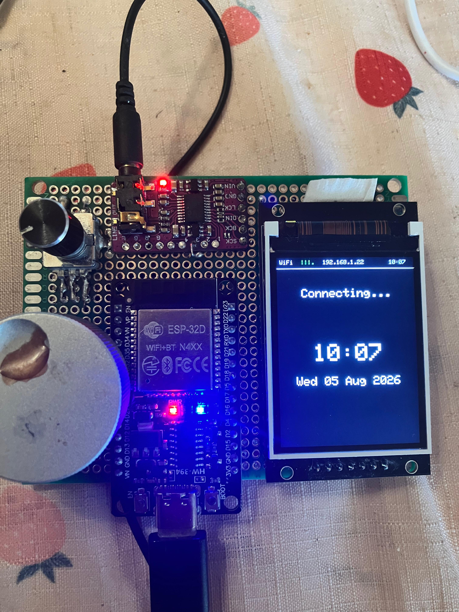

# ESP32 Smart Radio V2 - User Manual

I've done a major overhaul of this project!

I've removed the rotary encoders altogether and using capacitive touch
to control stations and volume.

I've also replace the ESP32-D with an ESP32-S3-N16R8 board. 
 

# Hardware
This project uses:

-ESP32 Dev board
- TFT display and capacitive touch controls
=======
- ESP32-S3-N16R8
- 4 wires for capasitive touch
- GMT020-02 ST7789 2" LCD
- GY-PCM5102 I2S Stereo Board

# User settings
This build uses my own local settings, these can be changed in the Webui.

## 1. Overview
ESP32 Smart Radio V2 is a Wi-Fi internet radio with a TFT display, touch controls, audio streaming, and a built-in browser-based Web UI for management.

Main features:
- Internet radio streaming
- On-device widgets (Clock, ADS-B, Weather, Tides, Audio, Favourites)
- Favourites management on-device and via Web UI
- ADS-B source/config management
- Tides config management
- Network scan/connect, saved Wi-Fi credentials, and AP mode

## 2. Hardware Controls
The current control layout uses one push button and four capacitive touch pads.

### GPIO 1 button
- Short press: advance to the next widget
- Long press: currently unused
- 
### Touch pads
- GPIO 2: previous station, or previous favourite on the Favourites widget
- GPIO 6: next station, or next favourite on the Favourites widget
- GPIO 4: volume down
- GPIO 5: volume up

When on the Favourites widget:
- GPIO 2/GPIO 6: move the selection through the favourites list
- After three seconds without another touch: play the selected favourite
=======
The device uses two rotary encoders.(4 wires)

### Pad 1 & 2 (Volume/Mute) (wires 2&3)
- Rotate(tap): change volume (0 to 21)
- Press: mute/unmute audio(long press button)

### Pad 3 & 4 (Station/Widget/Favourites) (wires 1&2)
Normal (most widgets):
- next/previous favourite station (main radio browsing now uses your favourites list)

### Button
- short press: changes between widgets
- long press: Not Programmed

## 3. Widget Behavior
### Widget selection
- Press Button to advance through Clock, ADS-B, Weather, Tides, Audio, Favourites, and System.

### Manual hold
- After manual widget selection, current widget is held.

## 4. Default Location and Time Settings
Compile-time defaults:
- Weather location label: Clarinbridge
- Weather coordinates: latitude 53.277, longitude -8.886
- ADS-B reference coordinates: latitude 53.277, longitude -8.886
- Tide location label: Galway
- Tide source URL: https://www.tidetime.org/europe/ireland/galway.htm
- Timezone: Irish time with DST (GMT0IST,M3.5.0/1,M10.5.0)
- All can be configured in include/config.h

Notes:
- ADS-B and Tides values can be changed in Web UI and saved to SPIFFS.
- Saved values override compile-time defaults after reboot.

## 5. First Boot and Startup
On startup the system initializes:
1. SPIFFS storage
2. Display
3. Wi-Fi (WiFiManager auto-connect)
4. Audio engine
5. Station manager and current station connection
6. Widgets
7. Web UI server
8. Weather engine update

If no saved Wi-Fi is available, WiFiManager may open a captive portal depending on your environment.

### Startup station behavior
- Main radio station browsing is sourced from favourites.
- Default startup station is Radio X when present in favourites.
- If favourites are empty, the system falls back to Radio X URL so playback still works.

## 6. Web UI
Open your radio IP in a browser (shown in serial logs and status bar when connected).

Top navigation pages:
- /
- /favourites
- /adsb
- /tides
- /network

### Home (/)
Landing page with links to all management pages.

### Favourites (/favourites)
- View favourites list
- Add a station (name + URL)
- Play a favourite
- Delete a favourite

API endpoints:
- GET /api/favourites
- POST /api/favourites
- DELETE /api/favourites?index=N
- POST /api/favourites/play?index=N

### ADS-B Config (/adsb)
Configure and save:
- Range (km)
- Local SSID match (optional)
- Local feed URL
- Public feed URL

Saved to:
- /adsb_config.json

### Tides Config (/tides)
Configure and save:
- Location name
- Latitude
- Longitude
- Refresh interval (minutes)
- Source URL (default TideTime Galway page)

Current behavior:
- Tide widget fetches the day's high and low events from the configured source URL.
- The widget displays each event in three columns: High/Low, Time, and Height.
- Default parser is built for the TideTime Galway page structure.

Saved to:
- /tides_config.json

### Network (/network)
Functions:
- View current SSID and IP
- Scan and join nearby networks
- Save Wi-Fi credentials
- Connect using saved credentials
- Delete saved credentials
- Enable AP mode

AP mode:
- SSID: ESP32-Radio-AP
- IP: 192.168.2.1

Saved networks file:
- /saved_networks.json

## 7. Persistence Files (SPIFFS)
The following files are created/used on SPIFFS:
- /favourites.json
- /adsb_config.json
- /tides_config.json
- /saved_networks.json

## 8. Build and Upload
Project is configured for PlatformIO.

Typical command:
- platformio run --target upload

Important:
- Partition scheme is set to huge_app.csv to fit current firmware size.

## 9. Troubleshooting
### Device boots but no audio
- Check station URL validity.
- Confirm Wi-Fi connected.
- Confirm not muted and volume > 0.

### Web UI unreachable
- Confirm device IP from serial logs/status bar.
- Ensure phone/PC is on same network.
- If AP mode enabled, connect to ESP32-Radio-AP and browse to 192.168.2.1.

### Favourites not updating
- Ensure both Name and URL are entered.
- Use full stream URLs including http:// or https://.

### Reset loops after major changes
- Re-upload latest stable build.
- Check monitor output at 115200.
- Reduce feature changes per build when diagnosing.

## 10. Operational Tips
- Use favourites for reliable station recall.
- Keep local ADS-B feed URL for home network and public URL for remote access.
- Tune tides refresh to balance data freshness and network usage.
- Keep saved Wi-Fi entries updated if passwords change.

## 11. Safety and Maintenance
- Power from a stable USB supply.
- Avoid abrupt power cuts during active writes where possible.
- Back up important SPIFFS config values if deploying multiple units.
